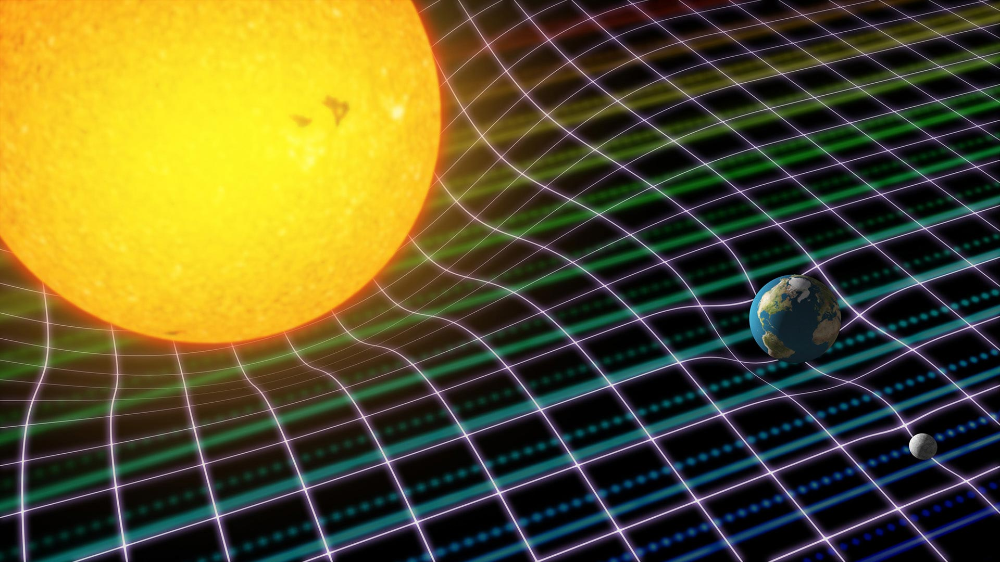
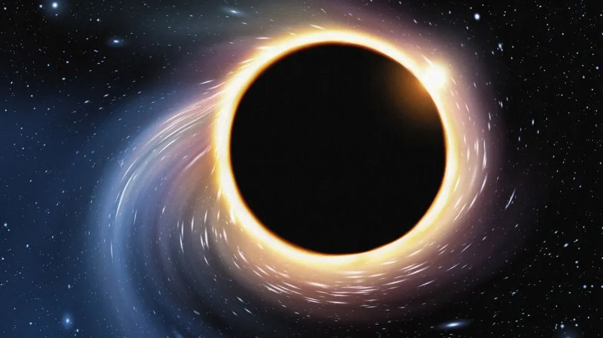
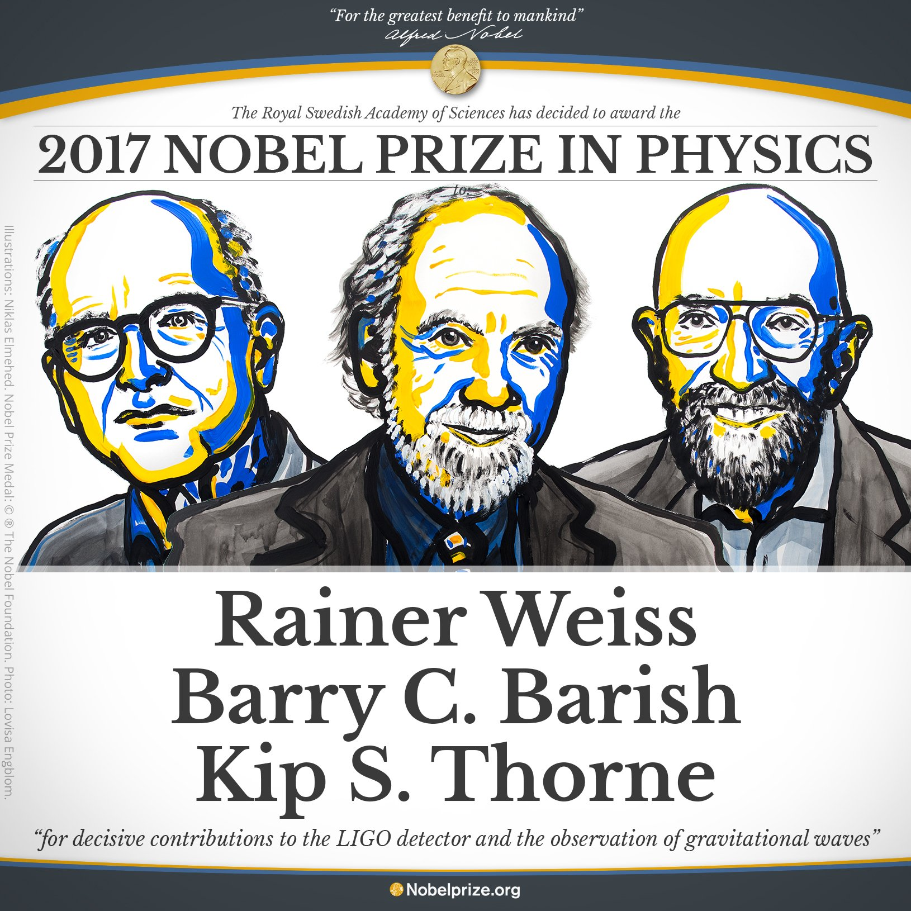

# **Introducción a la Relatividad Numérica**
## Clase 1
## Información del curso e introducción

---

## **¿Qué es la Relatividad Numérica?**

- La **Relatividad Numérica** es la rama de la física computacional que estudia soluciones de las ecuaciones de Einstein mediante técnicas numéricas.
- Permite explorar fenómenos gravitacionales que:
  - La gravedad Newtoniana no es capaz de describir.
  - Los métodos analíticos no son capaces de resolver.

---

## **Objetivos del curso**

En este curso, aprenderemos sobre:
- Los conceptos fundamentales de la Relatividad Numérica.
- Las principales aplicaciones en astrofísica y gravitación.
- Los desafíos computacionales que aparecen al intentar resolver las ecuaciones de Einstein.
- El rol de las simulaciones numéricas en el estudio de fenómenos gravitacionales extremos.

---

## **Modalidad del curso** 

- El curso se desarrollará mediante clases teóricas y sesiones prácticas.
- La primera parte del curso será principalmente teórica (~1 mes).
- Luego, nos concentraremos en la parte numérica y aplicaciones.

---

## **Aplicaciones de la Relatividad Numérica**

- **Ondas gravitacionales:** Permite predecir y analizar señales detectadas por observatorios como LIGO y Virgo.
- **Colisión de agujeros negros y estrellas de neutrones:** Permite modelar estos eventos y predecir sus efectos observacionales.
- **Colapso gravitacional y formación de agujeros negros:** Permite estudiar cómo se forman estos objetos.
- **Cosmología computacional:** Permite estudiar la evolución del universo y poner a prueba distintas teorías de la gravitación.

---

## **La gravedad y el espaciotiempo** 

---
## **Los agujeros negros** 

---

    <iframe 
        src="https://www.youtube-nocookie.com/embed/FGC_DM7ZgAk" 
        frameborder="0" 
        allow="accelerometer; autoplay; encrypted-media; gyroscope; picture-in-picture"
        allowfullscreen>
    </iframe>

---

## **Las ondas gravitacionales**

- En 2015, LIGO detectó por primera vez una señal de ondas gravitacionales generadas por la fusión de dos agujeros negros.
- Este evento confirmó una predicción importante de la Relatividad General de Einstein: la existencia de dichas ondas.
- Además, abrió una nueva era en la astronomía observacional.
- Actualmente se planean nuevos proyectos para medir ondas gravitacionales en el futuro, incluso en el espacio (LISA).

---

  

---

<!--  -->

  

---

## **Ecuaciones de Einstein**

$$
G_{\mu \nu} + \Lambda g_{\mu \nu} = \frac{8 \pi G}{c^4} T_{\mu \nu}
$$
donde
- $G_{\mu \nu}$: tensor de Einstein $\to$ la curvatura del espaciotiempo.
- $g_{\mu \nu}$: métrica del espaciotiempo $\to$ la geometría.
- $T_{\mu \nu}$: tensor energía-momento $\to$ materia y energía.
- $\Lambda$: constante cosmológica $\to$ expansión del universo.

---

## **Desafíos Computacionales**

1. **Ecuaciones altamente no lineales:** Las ecuaciones de Einstein son un sistema de ecuaciones en derivadas parciales no lineales, lo que dificulta su solución.
2. **Condiciones de frontera y estabilidad numérica:** Se deben diseñar algoritmos que garanticen estabilidad y precisión en la simulación de espaciotiempos curvos.
3. **Altos requerimientos computacionales:** Las simulaciones más realistas requieren una gran capacidad computacional, y típicamente se debe usar supercomputadores (clusters de cómputo).

---

## **Impacto en la Ciencia y la Tecnología**

La Relatividad Numérica no solo es relevante en la investigación teórica, sino que ha tenido un impacto profundo en áreas como:

- **Astronomía de ondas gravitacionales:** Interpretación de datos obtenidos de observatorios como LIGO y Virgo.
- **Exploración de nueva física:** Prueba de teorías alternativas de gravedad y materia oscura.
- **Desarrollo de algoritmos computacionales avanzados:** Métodos de integración numérica y técnicas de análisis de datos.

---

## **Contenidos del curso** 

- Comenzaremos con una introducción a la Relatividad General.
  - Conceptos principales (no exhaustivo): el espaciotiempo y la métrica, la curvatura, las Ecuaciones de Einstein.
- Discutiremos algunas de las soluciones de mayor importancia (agujero negro de Schwarzschild, ondas gravitacionales).
- Posteriormente discutiremos las ecuaciones que buscamos resolver en la Relatividad Numérica.
- Luego, revisaremos los métodos numéricos necesarios para resolver dichas ecuaciones.
- La parte final del curso estará enfocada en aplicaciones.

---

## **Evaluaciones del curso** 
- Tareas de ejercicios propuestos (30%)
    - Tarea 1: entrega semana 4 del curso.
    - Tarea 2: entrega semana 7 del curso.
- Un proyecto de investigación sobre un tópico afín:
  - Presentación de avance: 26 de junio (20%)
  - Presentación final: 10 y 17 de junio (50%)

- Prueba Extraordinaria: 23 de julio.

---

## **Bibliografía del curso** 

La mayor parte de los contenidos del curso se discuten en:
- T. Baumgarte & S. Shapiro, "Numerical Relativity: Starting from Scratch", Cambridge University Press, 1st edition, 2021.

Bibliografía complementaria:
- M. Alcubierre, "Introduction to 3+1 Numerical Relativity", Oxford University Press, 2008.
- S. Carroll, "Spacetime and Geometry: An Introduction to General Relativity", Addison-Wesley, 2003.

---

## **Próximas clases**

- Como punto de partida, estudiaremos la gravedad Newtoniana.
  - En particular, nos interesa entenderla en términos del Campo Gravitacional y su ecuación (de campo) governante.
  - Discutiremos algunas motivaciones que llevan a reemplazarla por la Relatividad General de Einstein.
- Haremos una revisión de algunas notaciones matemáticas necesarias para la Relatividad General.
  - Notación indicial para vectores y tensores. 
  - Notación de suma de Einstein.
  - Operaciones básicas con vectores y tensores (índices).
