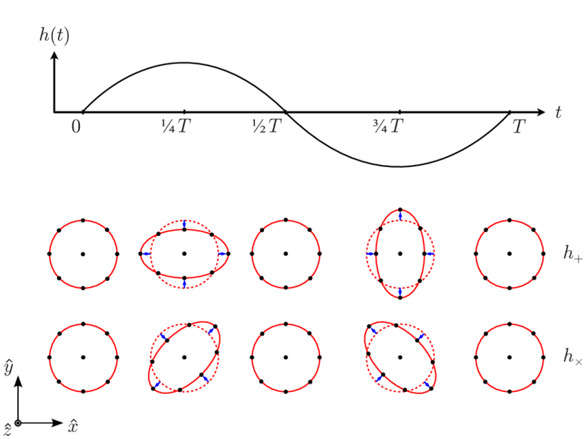

# **Ondas Gravitacionales**
## Clase 11

---

## **Objetivos de la Clase**
- Teoría de Perturbaciones.
- Aplicación a las Ecuaciones de Einstein.
- Ondas Gravitacionales.
- Fórmula del cuadrupolo para la emisión de ondas gravitacionales.

---

## **Teoría de Perturbaciones**

- La Teoría de Perturbaciones (TP) es usada en todas las áreas de la Física (notablemente en RG y Mecánica Cuántica).
- Idea central: si conocemos una solución analítica $f(x)$ de cierta ecuación diferencial, podemos buscar soluciones 'cercanas' mediante una **expansión perturbativa** sobre un parámetro $\lambda$ (el cual puede tener sentido físico, o ser artificial)

  $$
  F(x) = f_0 + \lambda^{1} f_1 + \lambda^{2} f_2 + ... = \sum_{i} \lambda^i f_i
  $$

  donde $f_0 = f$ es la solución del problema conocido.
---

<!-- ## **Teoría de Perturbaciones** -->

Luego:
1. Insertamos esta expansión en la ecuación que queremos resolver, y juntamos los términos del mismo orden en $\lambda$.
2. Por construcción, los términos sin $\lambda$ se cancelarán (ya que conocemos la solución base, i.e. $f_0$).
3. Exigimos que la igualdad de la ecuación se cumpla orden por orden en $\lambda$, lo cual nos otorga un conjunto de ecuaciones.
4. Finalmente, intentamos resolver dicho conjunto de ecuaciones en orden (jerárquicamente), empezando por $\mathcal{O}(\lambda^{1})$.

---

## **Teoría de Perturbaciones**

- Formalmente, el parámetro $\lambda$ es 'pequeño' en magnitud, i.e., debemos respetar la condición

$$
\vert \lambda \vert < 1\,.
$$

- Esto permite que la expansión perturbativa $F(x)= \sum_{i} \lambda^i f_i$ no diverja a medida que agregamos más y más términos.
- En caso de que converja, mientras más términos agreguemos, la solución será más precisa.
  - En la práctica, se suele parar en orden 1 (lineal) o 2.

---

## **Aplicación a las ecuaciones de Einstein**

- En RG se conocen pocas soluciones analíticas, pero podemos usarlas de $f_0$ e intentar buscar algunas otras soluciones.
- Por ejemplo, sabemos que la solución del espaciotiempo totalmente vacío en términos de coordenadas Cartesianas es la métrica de Minkowski:

$$
G_{\mu\nu} = T_{\mu\nu} = 0
$$

$$
\implies g_{\mu\nu} = \eta_{\mu\nu} = \textrm{diag}(-1,1,1,1)
$$

---

## **Ondas Gravitacionales**
- Ahora, consideremos una **pequeña perturbación** $h_{ab}$ sobre cada componente de la métrica de Minkowski:

  $$
  g_{ab} = \eta_{ab} + h_{ab}, \quad |h_{ab}| \ll 1
  $$

- *Linealizando* las ecuaciones de Einstein, i.e. considerando términos hasta $\mathcal{O}(h)$, se obtiene la ecuación de onda:

  $$
  (-\partial {}^{2}_{t} + \nabla^2)\bar{h}_{ab} \equiv  \Box \bar{h}_{ab} = 0
  $$

  donde $\bar{h}_{ab} = h_{ab} - \frac{1}{2} \eta_{ab} h$ se denomina la **perturbación métrica de traza inversa**.

---

## **Ondas Gravitacionales**

- Es decir, las EdE a primer orden en teoría de perturbaciones resultan en una ecuación de onda en el espacio-tiempo plano:

  $$
  \Box \bar{h}_{ab} = 0
  $$

- Esto implica que $\bar{h}_{ab}$ tiene un comportamiento ondulatorio, i.e. son **ondas gravitacionales**!
- Notar que, al igual que las ondas electromagnéticas, estas ondas se propagan en el vacío a la velocidad de la luz.
- Sin embargo, **lo que ondula es el espaciotiempo mismo!**

---

## **Ondas Gravitacionales**

- Notar que, al contrario que la solución de Schwarzschild, esta solución **no es estacionaria**, sino que depende del tiempo ya que se propaga.

<!-- - Al igual que en el caso de las ondas mecánicas o electromagnéticas, esta ecuación de onda admite soluciones de tipo **onda plana**: -->
<!---->
<!--   $$ -->
<!--   h_{ab} = A_{ab} e^{i k_c x^c} -->
<!--   $$ -->
<!---->
<!--   donde $k^c$ es el **vector de onda** y $A_{ab}$ es la **polarización**. -->
<!---->
<!--   - Ondas más complejas pueden escribirse como combinaciones lineales. -->

- Existen **dos tipos de polarización**: **plus ($+$) y cruz ($\times$)**.

Ahora, consideremos una onda plana que viaja a lo largo del eje $z$ hacia nosotros. 

Su efecto sobre un anillo de partículas de prueba será:

---

## **Ondas Gravitacionales**

---

## **Ondas Gravitacionales**

- Las ondas gravitacionales pueden interpretarse como una componente del campo gravitacional que **se propaga**.
- Notar que las obtuvimos mediante Teoría de Perturbaciones.
  - Su magnitud es extremadamente pequeña, incluso si se originaron debido a una gran densidad de materia/energía, e.g. un agujero negro no estático.
  - Debemos mirar regiones suficientemente lejanas donde el espaciotiempo sea muy cercano a Minkowski (este fue el 'background' o fondo que utilizamos para las perturbaciones).

---

## **Fórmula del Cuadrupolo**
- En concreto, las ondas gravitacionales **se originan o emiten** por el cambio en el **momento cuadrupolar** de un sistema.
- Para un sistema que evoluciona lentamente (respecto a la velocidad de la luz), la solución puede escribirse como:

  $$
  h_{ij}^{TT} \approx \frac{2}{d} \ddot{\mathcal{I}}_{ij}^{TT}(t - d)
  $$

  donde:
  - $d$ es la distancia entre la fuente y el observador.
  - $\mathcal{I}_{ij}^{TT}$ es el **tensor de momento cuadrupolar reducido**.

---

## **Fórmula del Cuadrupolo**

- Este último tensor está definido como:

$$
\mathcal{I}_{ij} = I_{ij} - \frac{1}{3}\delta_{ij} I 
$$

donde $I_{ij}$ es el tensor de momento cuadrupolar, dado por

$$
I_{ij} = \int \rho x^i x^j d^3x
$$

donde $\rho$ es la densidad de materia-energía.

---

## **Fórmula del Cuadrupolo**

- El 'TT' en el tensor $\mathcal{I}_{ij}^{TT}$ indica que este es 'transverse traceless'.
    - $\partial^j\mathcal{I}_{ij}^{TT}=\vec{0}$ ('transverse').
  - $\delta^{ij}\mathcal{I}_{ij}^{TT} = \mathcal{I}^{TT}=0$ ('traceless', sin traza).
- Para esto se aplica el 'proyector' $P_i^j = n_i^j - n_i n^j$:

$$
\mathcal{I}_{ij}^{TT} = \left(P_i^k P_j^l - \frac{1}{2} P_{ij}P^{kl}\right)\mathcal{I}_{kl}
$$

donde $n^i = x^i/d$ es el vector de distancia 'normalizado'.

---

## **Ejemplo: Sistema Binario**
- Consideremos un sistema de dos masas $m_1, m_2$ en **órbita circular** en el plano XY. Su **momento cuadrupolar** es:

  $$
  I_{ij} = \frac{1}{2} \mu R^2
  \begin{bmatrix}
  1 + \cos 2\omega t & \sin 2\omega t & 0 \\
  \sin 2\omega t & 1 - \cos 2\omega t & 0 \\
  0 & 0 & 0
  \end{bmatrix}
  $$

  donde:
  - $\mu = \frac{m_1 m_2}{m_1 + m_2}$ es la **masa reducida** del sistema.
  - $R$ es la **separación orbital**.
  - $\omega$ es la **frecuencia angular orbital**.
---

## **Ejercicio**

- Dado el tensor de momento cuadrupolar del sistema anterior, calcular $\mathcal{I}_{ij}$.

---

## **Conclusiones**

- Al resolver las EdE en el regimen perturbativo (con un 'background' o fondo de Minkowski), se obtiene una ecuación de onda, lo cual predice la existencia de ondas gravitacionales.
- Al contrario que Schwarzschild, estas ondas son **soluciones dinámicas**.
- Se originan/emiten cuando el **momento cuadrupolar** de un sistema cambia en el tiempo.
- Es posible obtener información sobre la fuente que las emite a través de ellas, e.g. su masa (veremos más sobre esto la próxima clase).

<!-- --- -->

<!-- ## **Próxima clase** -->
<!---->
<!-- - Análisis de la órbita del sistema binario. -->
<!-- - Propiedades de las ondas gravitacionales emitidas. -->
<!-- - Discusión de los resultados de LIGO-VIRGO. -->
<!-- - Conexión con Relatividad Numérica. -->
<!---->
