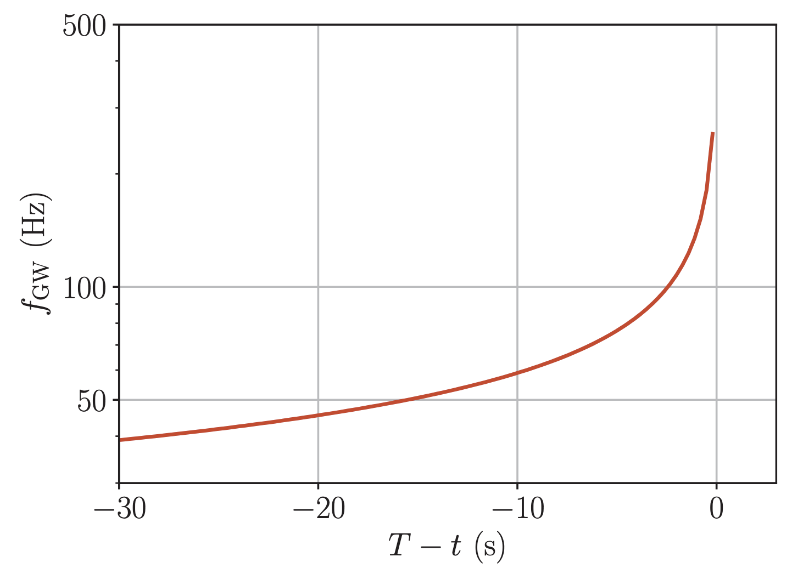
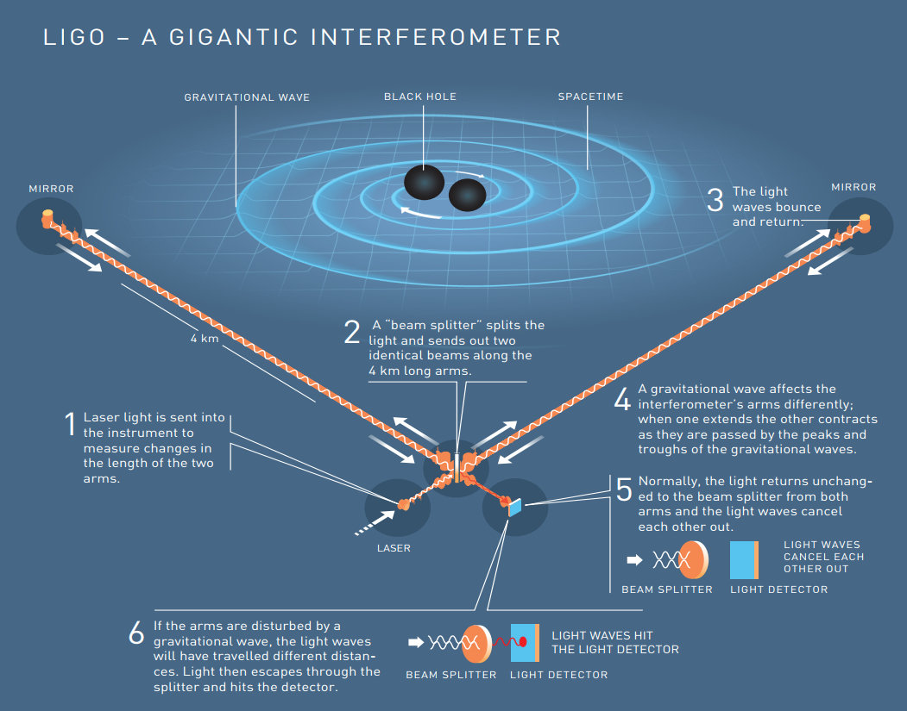
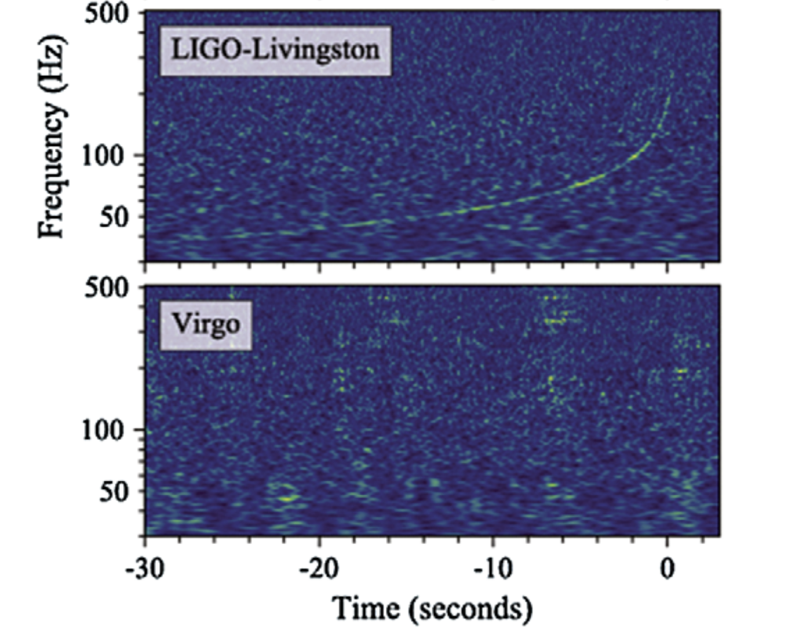
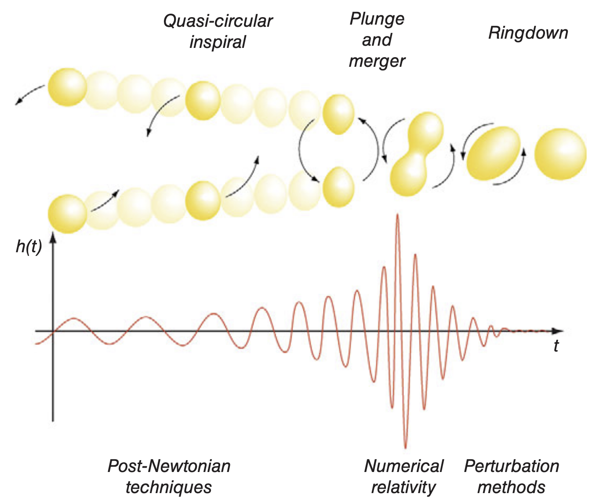

# **Ondas Gravitacionales pt 2**
## Clase 13

---

## **Objetivos de la Clase**
- Discutir la detección de ondas gravitacionales y su importancia en astrofísica.
- Analizar el proceso de **inspiral** y su relación con el "chirp" de la señal gravitacional.
- Relatividad Numérica.
<!-- - Taller. -->

---

## **Ejemplo: Sistema Binario**
- Consideremos un sistema de dos masas $m_1, m_2$ en **órbita circular** en el plano XY. Su **momento cuadrupolar** es:

  $$
  I_{ij} = \frac{1}{2} \mu R^2
  \begin{bmatrix}
  1 + \cos 2\omega t & \sin 2\omega t & 0 \\
  \sin 2\omega t & 1 - \cos 2\omega t & 0 \\
  0 & 0 & 0
  \end{bmatrix}
  $$

  donde:
  - $\mu = \frac{m_1 m_2}{m_1 + m_2}$ es la **masa reducida** del sistema.
  - $R$ es la **separación orbital**.
  - $\omega$ es la **frecuencia angular orbital**.

---

## **Pérdida de Energía por Emisión de Ondas**

- Al orbitar, el sistema emite ondas gravitacionales y pierde energía.
- La tasa de emisión de energía se obtiene como el promedio temporal:

    $$
  L_{\text{GW}}\equiv - \frac{dE}{dt} = \frac{1}{5} \langle \dddot{\mathcal{I}}^{ij} \dddot{\mathcal{I}}_{ij} \rangle
  $$

- Esta expresión se conoce como *formula cuadrupolar* (similar a la electrodinámica).

---

## **Pérdida de Energía por Emisión de Ondas**

- Para el **sistema binario**, esta expresión toma la forma:

  $$
  L_{\text{GW}} = \frac{32}{5} \frac{M^3 \mu^2}{R^5}
  $$

  donde $M = m_1 + m_2$ es la **masa total**.

- Esta pérdida de energía **reduce el radio orbital** y **aumenta la frecuencia de la órbita**.
- Inicialmente, el movimiento es casi perfectamente circular, y el radio cambia muy lentamente.

---

## **El Inspiral y la Señal "Chirp"**
- Usando que para un movimiento circular $E=-1/2 M\mu/R$:

  $$
  \frac{dR}{dt} = - \frac{64}{5} \frac{M^2 \mu}{R^3}
  $$

- Aplicando al sistema binario la ley de Kepler $\Omega=(M/R^3)^{1/2}$ e integrando, se obtiene la frecuencia de la onda gravitacional:

  $$
  f_{\text{GW}} = \frac{5^{3/8}}{8\pi} \frac{1}{M^{5/8} (T-t)^{3/8}}
  $$

  donde $T$ es el **tiempo de coalescencia**.

---

## **El Inspiral y la Señal "Chirp"**

---

## **La Primera Detección de Ondas Gravitacionales: GW150914**
- En 2015, **LIGO** detectó por primera vez ondas gravitacionales de la fusión de dos agujeros negros.
- El evento, llamado **GW150914**, confirmó directamente la predicción de Einstein.

---

## **El interferómetro de LIGO-Virgo**

---

## **Detección de LIGO-Virgo**

---

## **Más allá de las pertubaciones**

- El resultado discutido asume que el sistema orbita lentamente, y por lo tanto la señal predicha describe una fase inicial del sistema.
- La señal observada por LIGO-Virgo corresponde a la emitida durante esa fase.
- Como es la dinámica del sistema a lo largo del tiempo, más allá de esta fase inicial?

---

    <iframe 
        src="https://www.youtube-nocookie.com/embed/FGC_DM7ZgAk" 
        frameborder="0" 
        allow="accelerometer; autoplay; encrypted-media; gyroscope; picture-in-picture"
        allowfullscreen>
    </iframe>

---

---

## **Más allá de las pertubaciones**

- La señal que emite el sistema durante la etapa de **merger no puede obtenerse mediante cálculos analíticos**. Es necesario resolver las Ecuaciones de Einstein de forma numérica.
  - Esto es lo que llamamos Relatividad Numérica.
- Esto es altamente demandante técnica y computacionalmente.
  - Suele requerir supercomputadores.
  - Necesita cuidado con los métodos numéricos y errores.

- Sin embargo, es posible resolver numéricamente otros sistemas más simplificados (pero interesantes) de forma más modesta.

---

## **Relatividad Numérica**

- Es posible resolver numéricamente las ecuaciones de la RG.
  - Por ejemplo, mediante el método de **diferencias finitas** aplicado a EDP.
- Sin embargo, existen algunos problemas con las EdE.
  - Es posible mostrar que los errores en la solución tienden a acumularse en el tiempo, incluso si inicialmente la solución es muy precisa.
- Una opción es escribir las EdE en una forma equivalente, pero que sea numéricamente más favorable.

---

## **Relatividad Numérica**

- Esto no es siempre necesario. Pero sí lo es para algunos sistemas importantes, e.g. la colisión de agujeros negros o estrellas de neutrones.
- Esto se puede hacer con una formulación '3+1'.
- Veremos algo de esto en algunas clases más.
- Por ahora, nos detendremos a explorar un poco más las soluciones de las EdE que hemos visto.

---

## **Conclusion**
- Las ondas gravitacionales surgen de las ecuaciones de Einstein en el régimen de campo débil.
- Su emisión sigue la **fórmula del cuadrupolo** y depende de la segunda derivada del momento de masa.
- **Sistemas binarios** pierden energía por ondas gravitacionales, provocando **inspiral**.
- La **detección de GW150914** confirmó estas predicciones y abrió la era de la **astronomía de ondas gravitacionales**.

