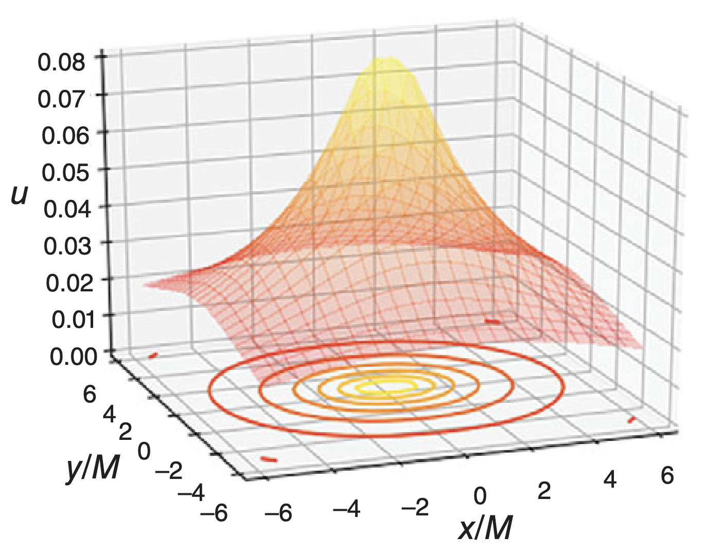

# **Construcción de datos iniciales**
## Clase 17

---

## **Construcción de datos iniciales**
- En RG, no es trivial definir condiciones iniciales.
  - Esto en sí mismo require buscar una solución de las EdE en $t=0$.
- Ahora veremos como construir datos iniciales para agujeros negros.
- El método utiliza transformaciones conformes para la solución de la **ecuaciones de restricción**.

<!-- --- -->
<!---->
<!-- ## **El Problema de los Datos Iniciales** -->
<!-- - Para evolucionar un sistema en RN (al igual que en otras áreas) necesitamos **datos iniciales válidos**. -->
<!--   - Las condiciones iniciales no son totalmente "libres": deben satisfacer las EdE. -->
<!-- - **Problema:** Las ecuaciones de restricción de Einstein son altamente no lineales. -->
<!---->
<!-- - Veremos un método para generar CI para **agujeros negros binarios**. -->

---

## **Ecuaciones de Einstein en forma 3+1**
Recordemos que la **métrica del espacio-tiempo** se escribe como:

$$
ds^2 = -\alpha^2 dt^2 + \gamma_{ij} (dx^i + \beta^i dt)(dx^j + \beta^j dt)
$$

donde:
- $\alpha$ es el **lapso** (controla la evolución temporal).
- $\beta^i$ es el vector de **shift** (controla el movimiento de las coordenadas espaciales entre las hipersuperficies 3D).
- $\gamma_{ij}$ es la **métrica espacial** en cada hipersuperficie 3D.

---

## **Ecuaciones de Einstein en forma 3+1**

La proyección de las EdE en cada hipersuperficie producen:

- Restricción Hamiltoniana:
$$
R + K^2 - K_{ij} K^{ij} = 16\pi \rho
$$

- Restricción de Momentos:
$$
D_j (K^{ij} - \gamma^{ij} K) = 8\pi S^i
$$

donde $S^i$ es el momento lineal.

---

## **Descomposición Conforme de la Métrica**

- No es trivial resolver las ecuaciones de restricción anteriores.
- Un método para facilitar su solución realizar una descomponer la métrica espacial en términos de un **factor conforme** $\psi$, tal que:

$$
\gamma_{ij} = \psi^4 \bar{\gamma}_{ij}
$$

donde:
- $\psi$ será determinado usando el constraint Hamiltoniano.
- $\bar{\gamma}_{ij}$ es la **métrica conforme**, que es libremente especificada.

---

## **Constraint Hamiltoniano conforme**

Con esto, la curvatura escalar (Ricci) se reescribe como:

$$
R = \psi^{-4} \bar{R} - 8 \psi^{-5} \bar{D}^2 \psi
$$

  - $\bar{D}=\bar{\gamma}_{ij}\bar{D}_i\bar{D}_j$, donde $\bar{D}_i$ es la derivada covariante en el espacio conforme.
- $\bar{R}$ es el escalar de Ricci en el espacio conforme.

Luego, sustituyendo en la restricción Hamiltoniana, tenemos:

$$
\bar{D}^2 \psi - \frac{1}{8} \bar{R} \psi + \frac{1}{8} \psi^5 (K_{ij} K^{ij} - K^2) = -2\pi \psi^5 \rho
$$

---

## **Ejemplo: Solución de Schwarzschild**

Consideremos nuevamente el espacio vacío. Además, asumamos:
- $\beta^i=0$ (corresponde a una *elección* de coordenadas espaciales), lo que implica que $K_{ij}=0$.
- El espacio es **conformalmente plano**: $\bar{\gamma}_{ij}=\delta_{ij}$.

En este caso, el constraint Hamiltoniano se reduce a:
$$
\bar{D}^2 \psi = \nabla^2 \psi = 0
$$

Esto ya lo sabemos resolver: es la ecuación de Poisson.

<!-- --- -->
<!---->
<!-- ## **Ejemplo: Solución de Schwarzschild** -->
<!---->
<!-- En coordenadas esféricas, con simetría esférica, esto se reduce a: -->
<!-- $$ -->
<!-- \left(\frac{1}{r^2}\frac{d(r\psi)}{dr}\right) = 0 -->
<!-- $$ -->

---

## **Ejemplo: Solución de Schwarzschild**

Luego, la solución radial es de la forma $\psi = A + B/r$.

Exigiendo que la solución decaiga en $r\to\infty$ hacia un espacio asintóticamente plano, y reescribiendo la constante $B=M/2$:

$$
\psi = 1 + \frac{M}{2r}
$$

Esto corresponde a la solución de Schwarzschild. Simplemente está escrita en otro sistema de coordenadas (gauge).

---

## **Datos iniciales de Brill-Lindsquit**

- En el caso anterior, el constraint Hamiltoniano, $\bar{D}^2 \psi = 0$, tiene una propiedad matemática muy importante: es **lineal**.
- Luego, la CI correspondiente a un conjunto de agujeros negros de Schwarzschild (estáticos) puede escribirse como:

$$
\psi = 1 + \sum_{n} \frac{M_n}{2r_n}
$$

Esto se conoce como la solución de **Brill-Lindquist**.

---

## **Datos iniciales de Brill-Lindsquit**

- Notemos que esta solución, si bien es analítica, es válida solo para **un instante** en el tiempo, e.g. una condición inicial.
- Al dejar correr el tiempo, es necesario resolver las ecuaciones de evolución, y el sistema se vuelve nuevamente no-lineal.

- ¿Qué pasa si queremos que inicialmente los agujeros negros estén en movimiento?

Para condiciones iniciales de agujeros negros en **movimiento**, es necesario también resolver la **restricción de Momento**. Ilustraremos esto a continuación.

---

## **Descomposición Conforme de $K_{ij}$**
Ahora, descomponemos la curvatura extrínseca $K_{ij}$ como:

$$
K_{ij} = A_{ij} + \frac{1}{3} \gamma_{ij} K
$$

- $K=\gamma^{ij}K_{ij}$ es la traza de $K_{ij}$. 
  - Típicamente es fijada por la variable temporal de nuestro sistema de coordenadas (slicing).
- $A_{ij}$ es la parte sin traza de $K_{ij}$.

---

## **Descomposición Conforme de $K_{ij}$**

La parte sin traza se puede descomponer conformalmente como:

$$
A_{ij} = \psi^{-10} \bar{A}_{ij}
$$

Con esto, la restricción de Momentos se reescribe como:

$$
\bar{D}_j \bar{A}^{ij} - \frac{2}{3} \psi^6 \bar{D}^i K = 8\pi \psi^{10} S^i
$$

A su vez, es posible descomponer $\bar{A}_{ij}$ en términos de dos componentes: $\bar{A}^{ij}_L$ (longitdutinal) y $\bar{A}^{ij}_{TT}$ (transverse-traceless).

---

## **Descomposición Conforme de $K_{ij}$**

Si bien no discutiremos en detalle, cualitativamente:

- $\bar{A}^{ij}_{TT}$ es la curvatura asociada a la presencia de **ondas gravitacionales**.
- Luego, **podemos escoger** $\bar{A}^{ij}_{TT}=0$ por simplicidad.
- $\bar{A}^{ij}_{L}$ típicamente será calculada mediante la restricción de
Momento.

---

## **Constraint Hamiltoniano conforme**

- Con todo lo anterior, el constraint Hamiltoniano puede escribirse **totalmente** en términos de variables conformes.
- En el caso del espaciotiempo vacío y conformalmente plano:

$$
\boxed{
\bar{D}^2 \psi + \frac{1}{8} \psi^{-7} \bar{A}^{ij}_L \bar{A}^{L}_{ij} = 0
}
$$

- Si el (o los) agujeros negros están en movimiento, el segundo término es en general $\neq0$, y $\bar{A}^{ij}_L$ debe determinarse a partir del constraint de Momento.

---

## **Constraint de Momento conforme**

- Por su parte, resolver el constraint de momento para determinar $\bar{A}^{ij}_L$ tampoco es trivial.
- De hecho, hasta ahora solo hemos discutido soluciones conformes del constraint Hamiltoniano.
- No discutiremos esta parte, pero existe una solución para $\bar{A}^{ij}_L$, conocida como **solución de Bowen-York** .

---

## **El Método de Punctures**
- Conocido $\bar{A}^{ij}_L$, nos queda por determinar $\psi$. Podemos "evitar" la singularidad en $r=0$ en la solución con el siguiente método.
- En vez de trabajar directamente con $\psi$, escribimos:
$$
\psi = 1 + \frac{1}{\alpha} + u
$$
donde:
- $\frac{1}{\alpha} = \sum_n \frac{M_n}{2s_n}$ describe el comportamiento singular de $\psi$.
- $u$ es una **corrección regular** que se resuelve numéricamente.

---

## **El Método de Punctures**

Sustituyendo en la restricción Hamiltona, obtenemos una ecuación no-lineal para $u$:

$$
\bar{D}^2 u = -\beta (\alpha + \alpha u + 1)^{-7}
$$

- Esto transforma el problema en la resolución de una ecuación **elíptica regular**, i.e. sin singularidades en su dominio.
  - Puede resolverse de forma numérica.

---

## **El Método de Punctures**

<!-- --- -->
<!---->
<!-- ## **Resumen de la Clase** -->
<!-- - Para modelar agujeros negros binarios en relatividad numérica, necesitamos resolver ecuaciones de restricción. -->
<!-- - El **método de punctures** evita la singularidad dividiendo la solución en una parte singular y una corrección regular. -->
<!-- - Se obtiene una ecuación elíptica para $u$, que puede resolverse numéricamente. -->
<!-- - Este método es la base de muchas simulaciones actuales de agujeros negros. -->
<!---->

---

## **Taller: Ecuaciones de Restricción**

- Ver apéndice B.2.3 del libro "Numerical Relativity: starting from scratch".
  - Utilizar el código `puncture.py`.
- Ver parte 4 del tutorial de NRPy+.
  - Utilizar los códigos de la sección "Initial data notebooks".

