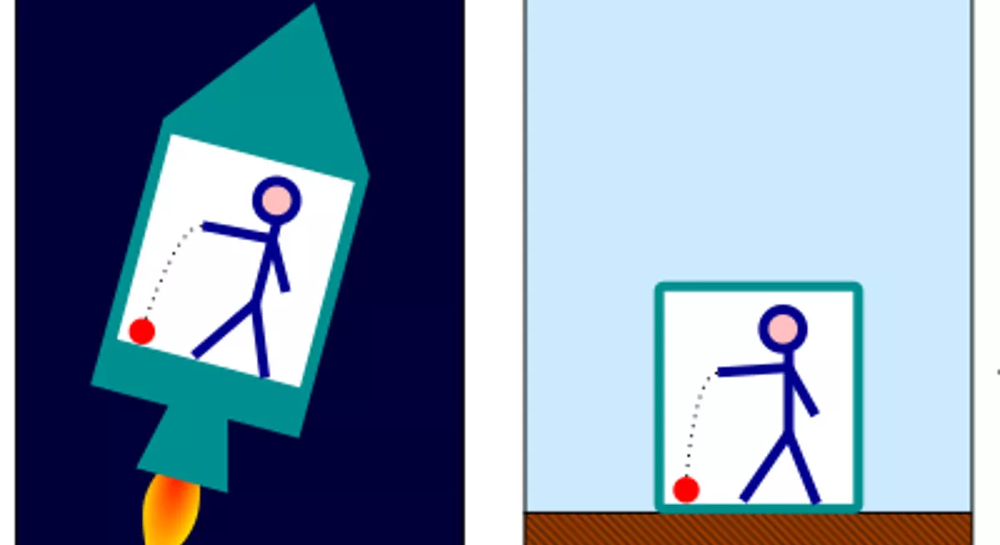
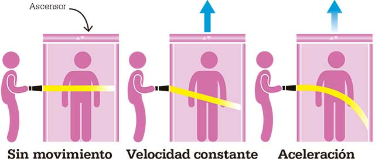
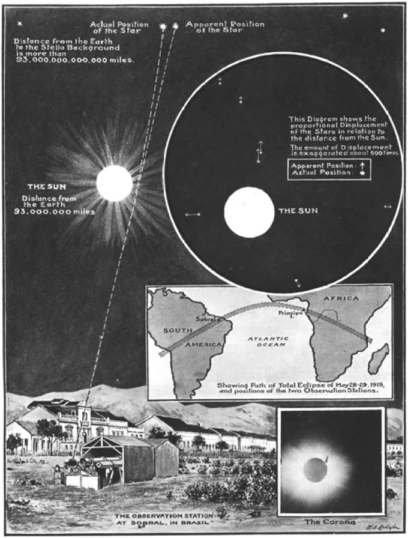

# **La Gravedad Newtoniana pt 2**
## Clase 3

---

## **Plan de la Clase**
- La ecuación de Poisson para el potencial gravitacional y algunas soluciones.
- Gravedad vs aceleración.
- La ecuación de marea y conexión con Relatividad General.

---

## **Ejemplo: Resolver la ecuación de Poisson para una masa puntual**

Resuelva la ecuación de Poisson 

$$
\nabla^2 \Phi = 4\pi G \rho
$$

para encontrar el campo producido por una masa puntual.

---

## **Ejemplo: Resolver la ecuación de Poisson para una masa puntual**

### Desarrollado en clase anterior, hasta aplicación de la Ley de Gauss

---

## **Ejemplo: Resolver la ecuación de Poisson para una masa puntual**

Ahora aplicamos las condiciones de borde sobre la solución.
1. Físicamente, esperamos una solución *asintóticamente plana*:
   $$
   \Phi(r\to\infty)\to0  \implies C_2=0
   $$

2. Para determinar $C_1$, podemos aplicar la *Ley de Gauss*:
$$
\oint_S \mathbf{g} \cdot dS =-\oint_S \mathbf{\nabla}\Phi \cdot dS = -4\pi G M_{\text{enc}}
$$
---

## **Ejemplo: Resolver la ecuación de Poisson para una masa puntual**

Integrando sobre una esfera de radio $\epsilon$, con $dS = r^2 d\Omega$, encontramos que:
$$
\left. \frac{d\Phi}{dr} \right|_{r=\epsilon} 4\pi r^2 = 4\pi G M
$$

Por lo que $C_1 = G M$. La solución final es entonces la esperada:

$$
\Phi(r) = -\frac{GM}{r}.
$$

---

## **Comentario sobre la solución** 

- Notar que aplicando la Ley de Gauss desde un comienzo también habría sido posible encontrar la solución.
  - Sin embargo, no la usamos ya que el ejercicio nos pedía resolver la ecuación de Poisson.
- En general utilizar la Ley de Gauss requiere menos cálculo.
  - Tiene alguna desvetaja este método de solución?

---

## **Ejemplo: Potencial Gravitacional de una Esfera Uniforme**
Considere una esfera uniforme de radio $R$ y densidad $\rho$ constante. 
Resolver la ecuación de Poisson $\nabla^2 \Phi = 4 \pi G \rho$ y encontrar el potencial asociado a dicha esfera.

---

## **Ejemplo: Potencial Gravitacional de una Esfera Uniforme**

- En coordenadas esféricas, la solución es una función radial.
- Solución interior ($r<R$):

$$ \Phi(r) = -\frac{2\pi G \rho}{3} r^2 + C $$

- Solución exterior ($r>R$):

$$ \Phi(r) = -G \frac{M}{r} $$

---

## **Ejemplo: Potencial Gravitacional de una Esfera Uniforme**

- ¿Cómo fijar la constante de integración $C$?
---

## **Gravedad vs Aceleración**

- Galileo Galilei (~1590) estudió la gravedad lanzando objetos desde la torre de Pisa y observando su movimiento.
  - Concluyó que todos los cuerpos caen con la **misma aceleración**, independiente de cual sea su masa.

- Einstein propuso el "experimento mental" de un ascensor para analizar esto en mayor detalle.
---

## **Experimento del ascensor**

Son equivalente ambas situaciones para la persona en el ascensor?

---

## **Experimento del ascensor**

Ahora, extendamos el análisis anterior al caso de un rayo de luz:

---

## **El Principio de Equivalencia de Einstein**

En base a este experimento mental, Einstein postuló que:

*Localmente, ningún experimento puede distinguir entre un campo gravitacional, y un sistema de referencia acelerado en ausencia de gravedad.*

---

## **El Principio de Equivalencia de Einstein**

De esta forma:
- Se explica que la **gravedad sí afecta la trayectoria de la luz**.
- Esto motiva el entender que la **gravedad puede ser interpretada como un efecto geométrico** en el espacio-tiempo.

<!-- --- -->
<!---->
<!-- ## **Gravedad vs Aceleración** -->
<!---->
<!-- - De lo anterior, podríamos concluir que podemos siempre utilizar la aceleración para detectar un campo gravitacional. -->
<!-- - Esto no es cierto en general.  -->
<!---->
<!-- --- -->
<!---->
<!-- ## **Experimento del ascensor** -->
<!---->
<!-- Imaginemos un observador dentro de un ascensor en caída libre en presencia de un campo gravitacional. Como tanto el ascensor como el observador están sujetos a la misma aceleración gravitacional: -->
<!---->
<!-- $$ a = -\nabla \Phi $$ -->
<!---->
<!-- En tal caso, el observador no siente ninguna fuerza y experimenta un entorno "sin gravedad". Este es el **Principio de Equivalencia** en su forma más básica. -->

---

  

