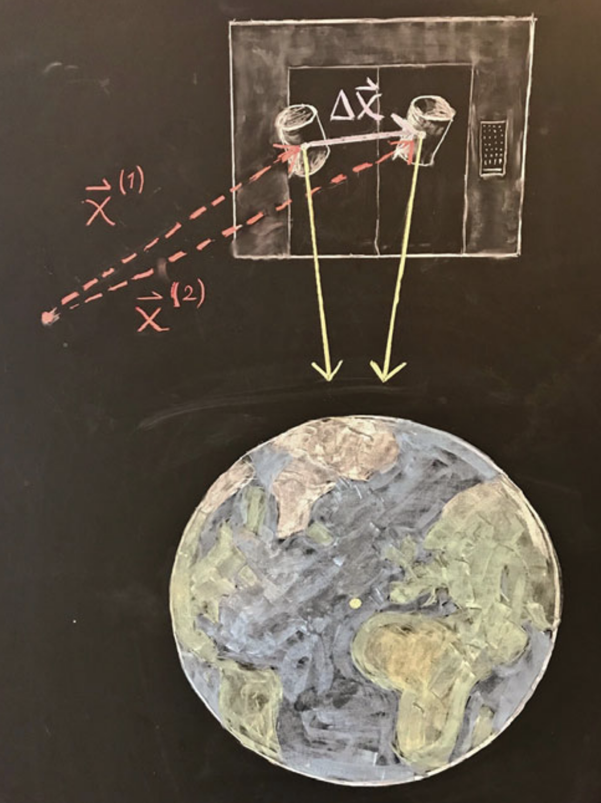

# **La Gravedad Newtoniana pt 2**
## Clase 3

---

## **Plan de la Clase**
- La ecuación de Poisson para el potencial gravitacional y algunas soluciones.
- Gravedad vs aceleración.
- La ecuación de marea y conexión con Relatividad General.

---

## **Ejemplo: Resolver la ecuación de Poisson para una masa puntual**

Resuelva la ecuación de Poisson 

$$
\nabla^2 \Phi = 4\pi G \rho
$$

para encontrar el campo producido por una masa puntual.

---

## **Ejemplo: Resolver la ecuación de Poisson para una masa puntual**

### Desarrollado en clase anterior, hasta aplicación de la Ley de Gauss

---

## **Ejemplo: Resolver la ecuación de Poisson para una masa puntual**

Ahora aplicamos las condiciones de borde sobre la solución.
1. Físicamente, esperamos una solución *asintóticamente plana*:
   $$
   \Phi(r\to\infty)\to0  \implies C_2=0
   $$

2. Para determinar $C_1$, podemos aplicar la *Ley de Gauss*:
$$
\oint_S \mathbf{g} \cdot dS =-\oint_S \mathbf{\nabla}\Phi \cdot dS = -4\pi G M_{\text{enc}}
$$
---

## **Ejemplo: Resolver la ecuación de Poisson para una masa puntual**

Integrando sobre una esfera de radio $\epsilon$, con $dS = r^2 d\Omega$, encontramos que:
$$
\left. \frac{d\Phi}{dr} \right|_{r=\epsilon} 4\pi r^2 = 4\pi G M
$$

Por lo que $C_1 = G M$. La solución final es entonces la esperada:

$$
\Phi(r) = -\frac{GM}{r}.
$$

---

## **Comentario sobre la solución** 

- Notar que aplicando la Ley de Gauss desde un comienzo también habría sido posible encontrar la solución.
- Sin embargo, no la usamos ya que el ejercicio nos pedía resolver la ecuación de Poisson.
- En general utilizar la Ley de Gauss requiere menos cálculo.
  - Tiene alguna desvetaja este método de solución?

---

## **Ejemplo: Potencial Gravitacional de una Esfera Uniforme**
Considere una esfera uniforme de radio $R$ y densidad $\rho$ constante. 
Resolver la ecuación de Poisson $\nabla^2 \Phi = 4 \pi G \rho$ y encontrar el potencial asociado a dicha esfera.

---

## **Ejemplo: Potencial Gravitacional de una Esfera Uniforme**

- En coordenadas esféricas, la solución es una función radial.
- Solución interior ($r<R$):

$$ \Phi(r) = -\frac{2\pi G \rho}{3} r^2 + C $$

- Solución exterior ($r>R$):

$$ \Phi(r) = -G \frac{M}{r} $$

<!-- - ¿Cómo fijar la constante de integración $C$? -->
---

## **Gravedad vs Aceleración**

- Galileo Galilei estudió la gravedad lanzando objetos desde la torre de Pisa y observando su movimiento.
  - Concluyó que todos los cuerpos caen con la **misma aceleración**, independiente de cual sea su masa.

- Einstein propuso el "experimento mental" de un ascensor para analizar esto en mayor detalle.
---

## **Experimento del ascensor**

---

## **Experimento del ascensor**

Ahora, extendamos el análisis anterior al caso de un rayo de luz:

---

## **El Principio de Equivalencia de Einstein**

En base a este experimento mental, Einstein postuló que:

*Localmente, no hay experimento físico que pueda distinguir entre un campo gravitacional, y un sistema de referencia acelerado en ausencia de gravedad.*

- Según esto, **no se puede diferenciar** entre estar en un campo gravitatorio o en un sistema acelerado.
- La **gravedad afecta la trayectoria de la luz**.

Esto motiva el entender que la **gravedad puede ser interpretada como un efecto geométrico** en el espacio-tiempo.

<!-- --- -->
<!---->
<!-- ## **Gravedad vs Aceleración** -->
<!---->
<!-- - De lo anterior, podríamos concluir que podemos siempre utilizar la aceleración para detectar un campo gravitacional. -->
<!-- - Esto no es cierto en general.  -->
<!---->
<!-- --- -->
<!---->
<!-- ## **Experimento del ascensor** -->
<!---->
<!-- Imaginemos un observador dentro de un ascensor en caída libre en presencia de un campo gravitacional. Como tanto el ascensor como el observador están sujetos a la misma aceleración gravitacional: -->
<!---->
<!-- $$ a = -\nabla \Phi $$ -->
<!---->
<!-- En tal caso, el observador no siente ninguna fuerza y experimenta un entorno "sin gravedad". Este es el **Principio de Equivalencia** en su forma más básica. -->

---

## **Experimento del ascensor**

- Se puede llegar a detectar de alguna forma el campo gravitacional en el experimento del ascensor?
- **Sí es posible medirlo**, pero se requiere realizar una medición **en un entorno** (región) dentro del ascensor.
    - No hay contradicción con lo concluido en el experimento anterior vale de forma **local**.

Consideremos, en el mismo ascensor, dos partículas muy cercanas con posiciones $x^i$ y $x^i + \Delta x^i$.

---

---

## **El Tensor de Marea**

Las ecuaciones de movimiento difieren debido a las variaciones en el campo gravitacional:

$$ \frac{d^2 x^i}{dt^2} = -\partial^i \Phi $$

Luego, para la separación $\Delta x^i$ entre las partículas tenemos:

$$ \frac{d^2 \Delta x_i}{dt^2} = -\Delta x^j (\partial_j \partial_i \Phi)$$

---

## **El Tensor de Marea**

Este efecto es conocido como **fuerza de marea**, y su intensidad está caracterizada por el **tensor de marea**:

$$ R_{ij} \equiv \partial_i \partial_j \Phi $$

El cual se asocia a la **ecuación de marea**:

$$ \frac{d^2 \Delta x^i}{dt^2} = -R^i_{\ j} \Delta x^j $$

Físicamente, este tensor **mide cómo la gravedad estira y comprime** los objetos en caída libre.

---

## **Relación con la Ecuación de Poisson**

Notar que, en coordenadas cartesianas:

$$ \nabla^2 \Phi = \partial^x\partial_x \Phi + \partial^y\partial_y \Phi +  \partial^z\partial_z \Phi = R^{i}_{i}$$

Luego, podemos reescribir la ecuación de Poisson como:

$$  R^{i}_{i} = 4\pi G \rho $$

Esta forma alternativa de la ecuación de Poisson será más cercana en forma a las ecuaciones de la Relatividad General.

---

## **Analogía con la Relatividad General**

| Cantidad | Gravedad Newtoniana | Relatividad General |
|---|---|---|
| Campo fundamental | Potencial $\Phi$ | Métrica $g_{\mu\nu}$ |
| Ecuación de movimiento | $\partial_i \Phi$ | Símbolos de Christoffel $\Gamma^\mu_{\alpha\beta}(g_{\mu\nu},\partial g_{\mu\nu}$) |
| Tensor de marea | $\partial_i \partial_j \Phi$ | Tensor de Riemann $R^\rho_{\sigma\mu\nu}$ |
| Ecuación de campo | $\nabla^2 \Phi = 4\pi G \rho$ | $G_{\mu\nu} = 8\pi G T_{\mu\nu}$ |

---

## **Limitaciones de la Gravedad Newtoniana**
- No explica experimentos tales como:
  - La desviación de la luz debido a la presencia de objetos masivos.
  - La precesión del perihelio de Mercurio.
- No es relativista (incompatible con la Relatividad Especial).
- No describe correctamente objetos compactos como agujeros negros.
- No predice las ondas gravitacionales.

---

## **Ejercicios Propuestos**
1. Derivar la ecuación de Poisson para el campo gravitacional a partir de las leyes de la gravedad Newtoniana.
2. Calcular el tensor de marea para una masa puntual.
<!-- 3. Comparar la aceleración de caída libre en diferentes marcos de referencia. -->

