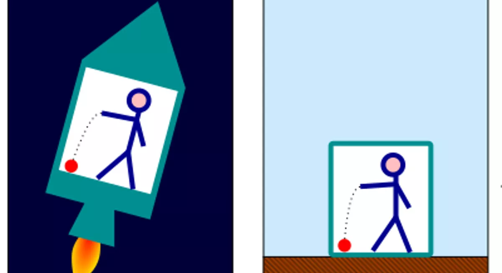

# **El tensor de marea**
## Clase 4

---

## **Plan de la Clase**
- La ecuación de marea y conexión con Relatividad General.

---

## **Experimento del ascensor**

---

## **Experimento del ascensor**

---

## **El Principio de Equivalencia de Einstein**

En base a este experimento mental, Einstein postuló que:

*Localmente, ningún experimento puede distinguir entre un campo gravitacional, y un sistema de referencia acelerado en ausencia de gravedad.*

---

## **Experimento del ascensor**

- Se puede llegar a detectar de alguna forma el campo gravitacional en el experimento del ascensor?
- **Sí es posible medirlo**, pero se requiere realizar una medición **en un entorno** (región) dentro del ascensor.
    - No hay contradicción con el Principio de Equivalencia, ya que este vale de forma **local**.

Ahora, consideremos en el mismo ascensor, dos partículas muy cercanas con posiciones $x^i$ y $x^i + \Delta x^i$.

---

---

## **El Tensor de Marea**

El movimiento de cada partícula en presencia del campo gravitacional está dada por la 2da ley de Newton:

$$ \frac{d^2 x^i}{dt^2} = -\partial^i \Phi $$

Aplicando esto a cada partícula, y expandiendo en serie de Taylor respecto a la separación $\Delta x^i$ entre las partículas:

$$ \frac{d^2 \Delta x_i}{dt^2} = -\Delta x^j (\partial_j \partial_i \Phi)$$

---

## **El Tensor de Marea**

Este efecto es conocido como **fuerza de marea**, y su magnitud está caracterizada por el **tensor de marea**:

$$ R_{ij} \equiv \partial_i \partial_j \Phi $$

el cual se asocia a la **ecuación de marea**:

$$ \frac{d^2 \Delta x^i}{dt^2} = -R^i_{\ j} \Delta x^j $$

Físicamente, este tensor mide como un campo gravitacional no uniforme **estira y comprime** los objetos en caída libre.

---

## **Relación con la Ecuación de Poisson**

Notar que, en coordenadas cartesianas:

$$ \nabla^2 \Phi = \partial^x\partial_x \Phi + \partial^y\partial_y \Phi +  \partial^z\partial_z \Phi = R^{i}_{i}$$

Luego, podemos reescribir la ecuación de Poisson como:

$$  R^{i}_{i} = 4\pi G \rho $$

Esta forma alternativa de la ecuación de Poisson será más cercana en forma a las ecuaciones de Einstein de la Relatividad General.

---

## **Analogía con la Relatividad General**

| Cantidad | Gravedad Newtoniana | Relatividad General |
|---|---|---|
| Campo fundamental | Potencial $\Phi$ | Métrica $g_{\mu\nu}$ |
| Ecuación de movimiento | $\partial_i \Phi$ | Símbolos de Christoffel $\Gamma^\mu_{\alpha\beta}(g_{\mu\nu},\partial g_{\mu\nu}$) |
| Tensor de marea | $\partial_i \partial_j \Phi$ | Tensor de Riemann $R^\rho_{\sigma\mu\nu}$ |
| Ecuación de campo | $\nabla^2 \Phi = 4\pi G \rho$ | $G_{\mu\nu} = 8\pi G T_{\mu\nu}$ |

---

## **Conclusiones**
- La gravedad Newtoniana puede entenderse en términos de **un campo gravitacional**, el que satisface la **ecuación de Poisson**.
- Sin embargo, esta no explica experimentos tales como:
  - La desviación de la luz debido a la gravedad.
  - La precesión del perihelio de Mercurio.
- No es relativista (incompatible con la Relatividad Especial).
- No describe agujeros negros.
- No predice las ondas gravitacionales.

---

## **Ejercicios Propuestos**
1. Derivar la ecuación de Poisson para el campo gravitacional a partir de las leyes de la gravedad Newtoniana.
2. Calcular el tensor de marea para una masa puntual.
<!-- 3. Comparar la aceleración de caída libre en diferentes marcos de referencia. -->
