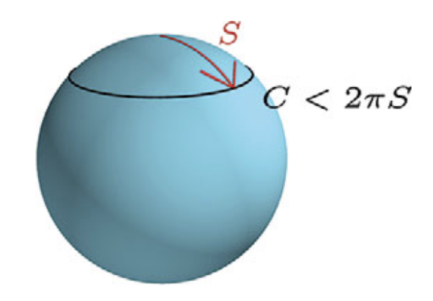

# **La métrica y espacios curvos**
## Clase 6

---

## **Plan de la Clase**
- El tensor métrico y el elemento de línea.
- La curvatura del espacio.

---

## **Hacia la Relatividad General**

- En la gravedad Newtoniana, la equivalencia entre masa inercial y gravitacional es un **hecho experimental**, sin una justificación fundamental.
- **Einstein** vio esto como un indicio de una estructura más profunda.
- En lugar de depender de las propiedades individuales de los objetos, la gravedad debe ser una propiedad del **espacio-tiempo mismo**.
   - En particular, en una manifestación de su **curvatura**.

---

## **La métrica**

- Una **métrica** es una herramienta para medir **distancias** en un espacio.
- En coordenadas, se representa por el **elemento de línea**:

$$
ds^2 = g_{ij} dx^i dx^j
$$

- $g_{ij}$ son las **componentes del tensor métrico**.
- El espacio puede ser **plano o curvo** dependiendo de cómo se comporta $g_{ij}$.

---

## **Ejemplo: Plano Euclideano 2D**

- En coordenadas cartesianas $(x, y)$:

$$
ds^2 = dx^2 + dy^2
$$

- En coordenadas polares $(r, \theta)$:

$$
ds^2 = dr^2 + r^2 d\theta^2
$$

- Aunque la forma cambia, el espacio sigue siendo plano!
  - Es posible mostra que la curvatura es 0 en ambos casos.

---

## **Geometría curva**

Consideremos ahora una esfera. Notar que hablamos de una *superficie*, i.e. un espacio 2D. Usamos coordenadas $(\theta, \phi)$:

- $\theta$: ángulo polar (de $0$ a $\pi$)
- $\phi$: ángulo azimutal (de $0$ a $2\pi$)

La métrica en la superficie de la esfera de radio $R$ es:

$$
ds^2 = R^2 \left( d\theta^2 + \sin^2 \theta \, d\phi^2 \right)
$$

---

## **Geometría curva**

Un ejemplo de geometría curva es la superficie de una esfera:

---

## **Geometría curva**

- Si recorremos imaginariamente la superficie, podemos darnos cuenta que el espacio es curvo:
  - En el camino mostrado en la figura, podemos verificar que no se respeta la relación $C=2\pi S$.
  - Alternativamente, podemos trazar una trayectoria "triangular", y verificar que la suma de los ángulos internos de dicho triángulo es mayor que $180°$.

Notar que, *localmente*, la superficie de la esfera **parece plana** en vez de curva (como en el caso de la Tierra). 

---

## **La curvatura en la esfera**

- Notemos que, según la dirección (ángulo) en que nos movamos sobre la esfera, la distancia recorrida es distinta:

$$
ds^2 = R^2 d\theta^2 + R^2 \sin^2 \theta d\phi^2
$$

- A lo largo de una línea de $\theta = \text{const}$:

$$
ds = R \sin \theta d\phi \quad \text{(círculo de latitud)}
$$

- A lo largo de una línea de $\phi = \text{const}$:

$$
ds = R d\theta \quad \text{(de polo a polo)}
$$

---

## **La curvatura en la esfera**

- Es posible mostrar que la **curvatura escalar** (curvatura Gaussiana) $K$ en la esfera es:

$$
K = \frac{1}{R^2}
$$

- Esta curvatura es **constante y positiva**. En general:
- En espacios planos, $K = 0$.
- En espacios hiperbólicos, $K < 0$.
- En espacios parabólicos, $K > 0$.

