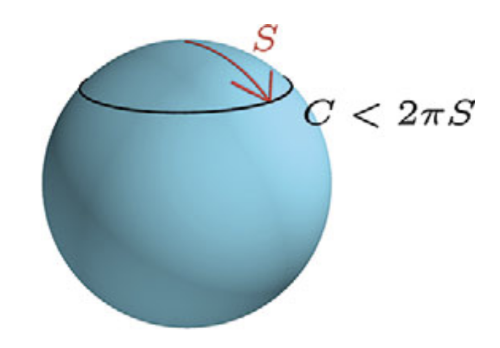

# **Espaciotiempo y las geodésicas**
## Clase 7

---

## **Plan de la Clase**
- La métrica del espacio-tiempo.
- Ejemplo: la métrica de Minkowski.
- La ecuación geodésica.

---

## **La métrica**

- En cualquier sistema de coordenadas, el **elemento de línea** es:

$$
\boxed{
ds^2 = g_{ij} dx^i dx^j
}
$$

- Dicho de otra forma, $ds^2$ es **independiente** de las coordenadas (es una cantidad *escalar*).
- El espacio puede ser **plano o curvo** dependiendo de cómo se comporta $g_{ij}$.
  - La curvatura se relaciona a sus **segundas derivadas**.

---

## **Espacio vs espaciotiempo**

- Hasta ahora, hemos descrito **espacios puramente espaciales**.
  - Dado que el tiempo no es absoluto en RG, para describir *eventos* necesitamos agregar una **coordenada temporal** $t$:

$$
x^\mu = (t, x, y, z)
$$

- En general, otro observador podrá identificar el mismo evento con coordenadas $x'^\mu = (t', x', y', z')$.
    - Ambos se podrán relacionar de forma unívoca mediante una transformación de coordenadas $x^\mu\to x'^\mu$.

---

## **Espacio vs espaciotiempo**

- Notar que las métricas anteriores (espaciales) siempre fueron tales que las distancias medidas son **positivas** .
  - Al agregar una coordenada temporal, esto último ya no será cierto.
- Por convención, $g_{00}$ será **negativa**.
- Entonces, $ds^2$ podrá ser positivo, negativo, o cero.

<!-- - **Intervalo de tiempo propio** de un observador ($dx^i=0$) : -->
<!-- $$ -->
<!-- d\tau^2 = -ds^2  -->
<!-- $$ -->
<!---->
<!-- - **Distancias espaciales propias** ($dt=0$): -->
<!-- $$ -->
<!-- dl^2 = ds^2  -->
<!-- $$ -->
<!---->
---

## **El Espaciotiempo de Minkowski**

- Un caso particular es el espaciotiempo **plano**, que describe la Relatividad Especial, y se denomina la **métrica de Minkowski**:

$$ g_{\mu\nu} = \eta_{\mu\nu} = \begin{bmatrix} -1 & 0 & 0 & 0 \\ 0 & 1 & 0 & 0 \\ 0 & 0 & 1 & 0 \\ 0 & 0 & 0 & 1 \end{bmatrix} $$

- En coordenadas cartesianas $x^\mu = (t, x, y, z)$, tenemos:

$$ ds^2 = -dt^2 + dx^2 + dy^2 + dz^2 $$

---

<!-- - Es la versión relativista del **Teorema de Pitágoras**. -->

<!-- --- -->
<!-- ## **Cono de luz y causalidad** -->
<!---->
<!---->
<!--  -->
<!---->
<!-- --- -->
<!---->
<!-- ## **Tipos de Intervalos en Espaciotiempo** -->
<!---->
<!-- Dependiendo del signo de $ds^2$, tenemos diferentes tipos de separación entre eventos: -->
<!---->
<!-- 1. **Intervalo Espacial ($ds^2 > 0$)** -->
<!--    - Predomina la separación en espacio. -->
<!--    - Puede medirse con **reglas**. -->
<!---->
<!-- --- -->
<!---->
<!-- ## **Tipos de Intervalos en Espaciotiempo** -->
<!---->
<!-- 2. **Intervalo Temporal ($ds^2 < 0$)** -->
<!--    - Predomina la separación en tiempo. -->
<!--    - Puede medirse con **relojes.** -->
<!--    - Los objetos con masa solo pueden seguir trayectorias de este tipo. -->
<!---->
<!-- 3. **Intervalo Nulo ($ds^2 = 0$)** -->
<!--    - Trayectoria seguida por la luz. -->
<!--    - Define los **conos de luz**, lo cuales definen la **causalidad** . -->
<!---->
<!-- --- -->
<!---->
<!-- ## **Cono de Luz y Causalidad** -->
<!---->
<!-- - En un diagrama espacio-tiempo, los eventos que pueden estar causalmente conectados deben estar dentro del **cono de luz**. -->
<!-- - Los eventos **fuera del cono de luz** no pueden afectarse mutuamente. -->
<!-- - Esto define la **causalidad en Relatividad Especial y General**. -->
<!---->
<!-- Dos eventos separados por un intervalo **espacial** no pueden afectarse entre sí, ya que ningún objeto puede viajar más rápido que la luz. -->

## **Curvatura y Geodésicas**

- En Relatividad General, **la gravedad no es una fuerza**.
- Los objetos siguen las trayectorias **más rectas posibles** en un espacio-tiempo curvo.
   - Estas trayectorias se llaman **geodésicas**.

**En el ejemplo anterior de una esfera:**
- En la Tierra, la ruta más corta entre dos puntos es un arco de un círculo máximo.

---
## **Curvatura y Geodésicas**

<!-- - De manera similar, los objetos siguen geodésicas en el espacio-tiempo curvo. -->

<!-- --- -->
<!---->
<!-- ## **Geometría curva** -->
<!---->
<!-- Discutamos otra propiedad importante que se "pierde" en espacio curvos como la esfera: -->
<!---->
<!--  -->

---

## **Derivadas de tensores**

- La noción de derivada está bien definida para **escalares**.
  - Simplemente comparamos su valor en dos puntos distintos.
  - Por ejemplo:
$$
\partial_x f(t,x,y,z) = \lim_{\Delta x\to0} \frac{f(t,x+\Delta x,y,z) - f(t,x,y,z)}{\Delta x}
$$

---

## **Derivadas de tensores**

- En el caso de tensores de rango 1 o más (vectores, tensores), esto genera una ambiguedad:
    - Si queremos comparar dos vectores, debemos "mover" (*transportar*) uno de ellos hasta que "las flechas coincidan en su origen".
  - Sin embargo, en este proceso puede estar "contaminado artificialmente" ya que las componentes del vector pueden cambiar por el hecho de que **vectores base cambian**.

---

## **La derivada covariante**

  - En espacios curvos, la noción de derivada tradicional (parcial) se generaliza a la **derivada covariante**:

$$
\nabla_\mu v^\alpha = \partial_\mu v^\alpha + \Gamma^\alpha_{\mu\nu} v^\nu
$$

$$
\nabla_\mu v_\alpha = \partial_\mu v_\alpha - \Gamma^\nu_{\mu\alpha} v_\nu
$$

- Esta derivada permite comparar vectores **tras descontar el cambio en los vectores bases**, i.e. es la diferencia "real".

---

## **La derivada covariante**

- Para tensores de rango 2:

$$
\nabla_\lambda T^{\mu\nu} =
\partial_\lambda T^{\mu\nu}
+ \Gamma^\mu_{\lambda\rho} T^{\rho\nu}
+ \Gamma^\nu_{\lambda\rho} T^{\mu\rho}
$$

$$
\nabla_\lambda T_{\mu\nu} =
\partial_\lambda T_{\mu\nu}
- \Gamma^\rho_{\lambda\mu} T_{\rho\nu}
- \Gamma^\rho_{\lambda\nu} T_{\mu\rho}
$$

$$
\nabla_\lambda T_{\mu\nu} =
\partial_\lambda T_{\mu\nu}
- \Gamma^\rho_{\lambda\mu} T_{\rho\nu}
- \Gamma^\rho_{\lambda\nu} T_{\mu\rho}
$$

- Es decir, aplicamos un objeto "$\Gamma$" por cada índice.
- Para escalares (rango 0), esta se reduce a la derivada parcial.

---

## **La conexión: símbolos de Christoffel**

- En la definición anterior, aparece un objeto llamado "conexión":
$$
\Gamma^\alpha_{\mu\nu} = \frac{1}{2} g^{\alpha\beta} 
\left(\partial_\mu g_{\nu\beta} + \partial_\nu g_{\mu\beta} - \partial_\beta g_{\mu\nu}\right)
$$

- La conexión precisamente mide **cómo cambia la base de vectores** al desplazarse por la variedad
- Satisface la condición de *compatibilidad con la métrica*:

$$
\nabla_\alpha g_{\mu\nu} = 0.
$$

---

## **Geodésicas**
- En Física Newtoniana, para un objeto libre de fuerzas externas:

$$
a^i=\frac{dv^i}{dt}=\frac{d^2x^i}{dt^2} = 0
$$ 

por lo tanto se mueve en una **trayectoria rectilínea** con **velocidad constante** (tanto magnitud como dirección).

---

## **Geodésicas**

- En Relatividad, definimos la **cuadri-velocidad** de un objeto respecto a un observador como
$$
v^\mu=\frac{dx^\mu}{d\tau}
$$
donde $\tau$ es su tiempo propio (medido por un reloj del observador).

---

## **La ecuación geodésica**

- En RG, la gravedad ya no es una fuerza, i.e. las partículas son "libres" (a menos que incluyamos una fuerza **real**).
- Luego, podemos generalizar el concepto de "recta" a un espaciotiempo curvo en función de la cuadri-aceleración como:
$$
a^\mu=\frac{Dv^\mu}{D\tau}=u^\mu \nabla_\nu u^\nu = 0
$$ 

- Esta se denomina **ecuación geodésica**.

---

## **La ecuación geodésica**

- Explícitamente, la ecuación geodésica toma la forma:

$$
\boxed{
\frac{d^2 x^\alpha}{d\tau^2} + \Gamma^\alpha_{\mu\nu} \frac{dx^\mu}{d\tau}\frac{dx^\nu}{d\tau} = 0
}
$$

- Formalmente, las **geodésicas** son trayectorias que extremizan la *acción* que describe una partícula en la RG.
   - Los cuerpos con masa siguen trayectorias que **maximizan el tiempo propio**.
